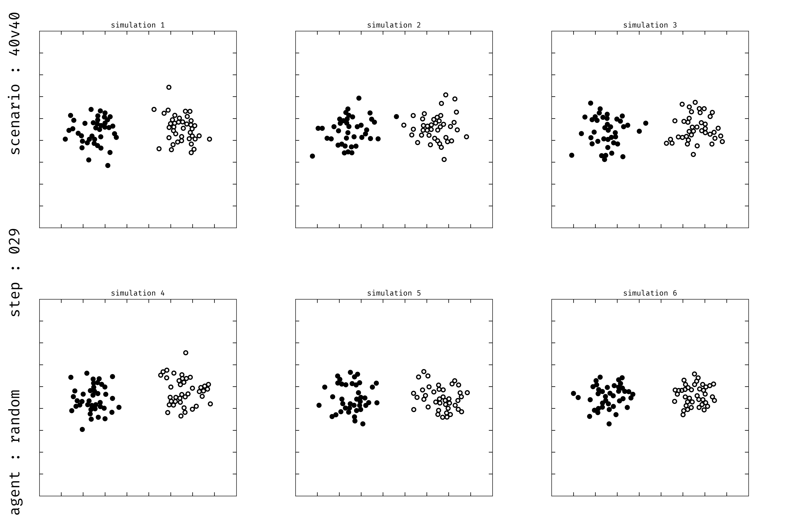

# Behaviour trees

- Behaviour trees (BT) are a way to model the behaviour of agents.
- They are used in games and robotics.

## Atomics

- Atomics are the leaves of the tree.
- They are the actions that the agent can take.

# SMAX

- Extensive work on visual playback of trajectory [@fig:smax].
    - [x] Costum SMAX [@rutherford2023] vizualization.
    - [x] Show unit type, team, health, attacks, and reward.
    - [x] Successfully runnning 10K+ parallel environments.

---

{#fig:smax}

## SMAX (cont.)

    key = random.PRNGKey(0).split(num_envs)
    env = make('SMAX', num_allies=n, num_enemies=m)
    obs, state = vmap(env.reset)(key)
    for _ in range(num_steps):
        act = vmap(act_fn)(rng, env, obs, state)
        obs, state, (_) = vmap(env.step)(act, state)

# Next step

- Visualise bullets and attacked states.
- Take action from BT.